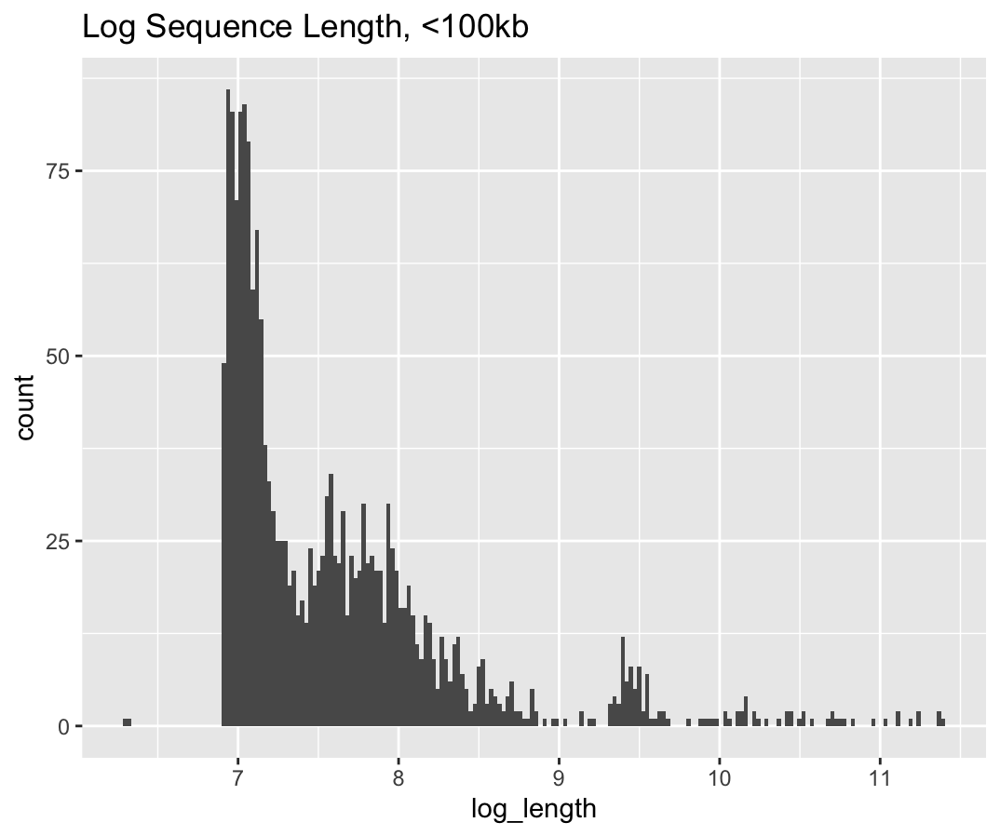
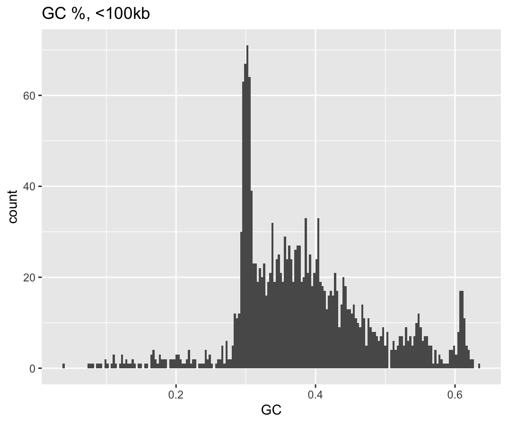
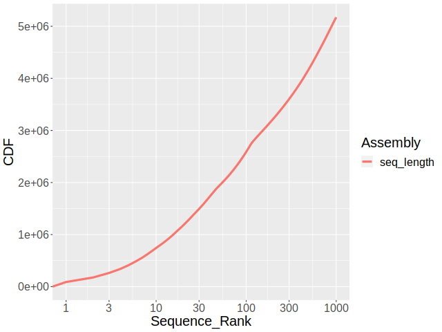
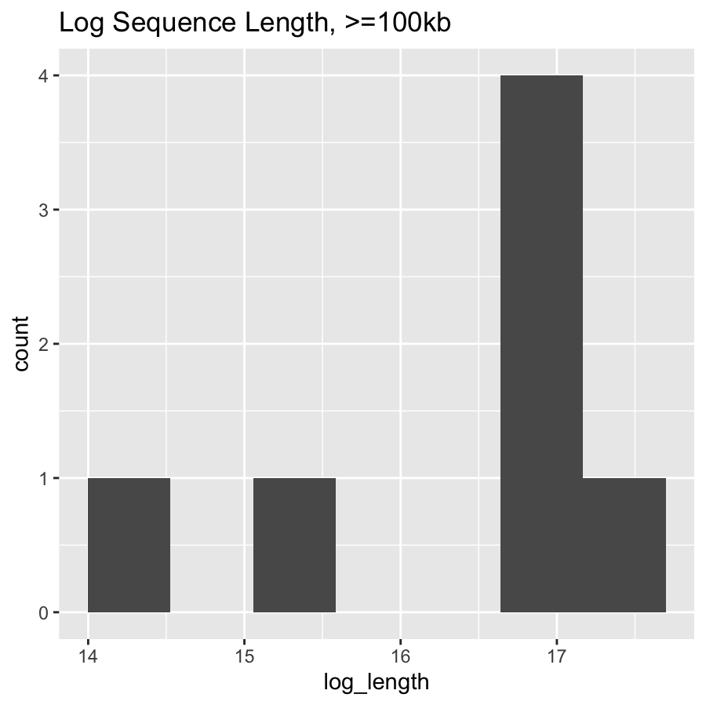
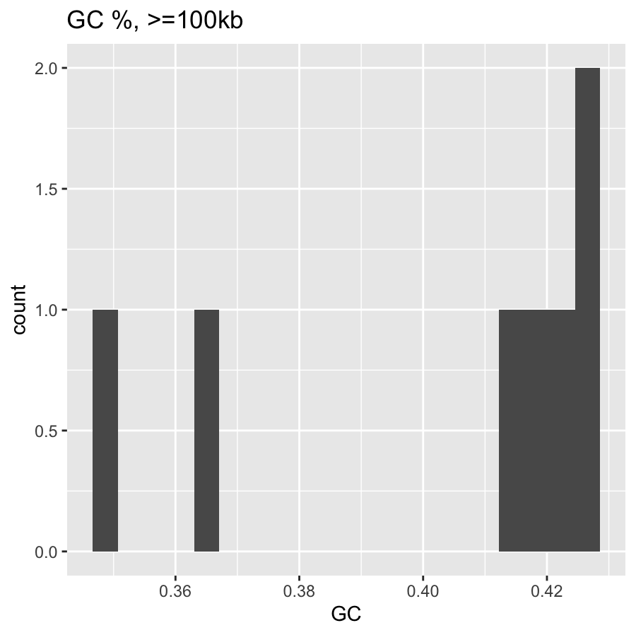
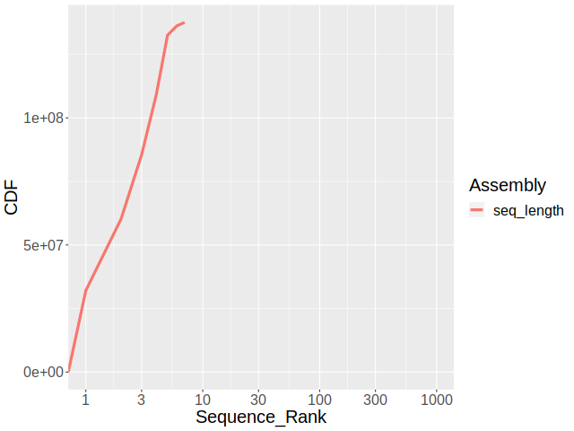

## Homework 4

### Emily Tom

#### 12-5-22

### Summarize Partitions of a Genome Assembly

#### Calculate the following for all sequences ≤ 100kb and all sequences \> 100kb:

    srun -A class-ee282 --pty bash -i
    conda activate ee282
    wget http://ftp.flybase.net/releases/FB2022_05/dmel_r6.48/fasta/dmel-all-chromosome-r6.48.fasta.gz
    gunzip dmel-all-chromosome-r6.48.fasta

    faFilter -maxSize=100000 dmel-all-chromosome-r6.48.fasta less.fasta
    faSize less.fasta
    faFilter -minSize=100001 dmel-all-chromosome-r6.48.fasta more.fasta
    faSize more.fasta

≤ 100kb

1.  Total number of nucleotides: 6178042

2.  Total number of Ns: 662593

3.  Total number of sequences: 1863

\> 100kb

1.  Total number of nucleotides: 137547960

2.  Total number of Ns: 490385

3.  Total number of sequences: 7

#### Plots of the following for for all sequences ≤ 100kb and all sequences \> 100kb:

    bioawk -c fastx '{ print $name "\t" length($seq) "\tshort" } ' less.fasta > length_short.txt
    bioawk -c fastx '{ print $name "\t" length($seq) "\tlong" } ' more.fasta > length_long.txt

    bioawk -c fastx '{ print $name "\t" gc($seq) "\tshort" } ' less.fasta > gc_short.txt
    bioawk -c fastx '{ print $name "\t" gc($seq) "\tlong" } ' more.fasta > gc_long.txt

≤ 100kb

Histograms were created in R Studio using ggplot2. Full code can be found in `/code/scripts/length_GC_plotting.R`

1.  sequence length distribution

    

2.  GC% distribution

    

3.  cumulative sequence size

<!-- -->

    bioawk -c fastx ' { print length($seq) } ' less.fasta | sort -rn | awk ' BEGIN { print "Assembly\tLength\nseq_length\t0" } { print "seq_length\t" $1 } ' > seq_less.lengths

    plotCDF2 seq_less.lengths CDFless.png

\> 100kb

1.  sequence length distribution

    

2.  GC% distribution

    

3.  cumulative sequence size

        bioawk -c fastx ' { print length($seq) } ' more.fasta | sort -rn | awk ' BEGIN { print "Assembly\tLength\nseq_length\t0" } { print "seq_length\t" $1 } ' > seq_more.lengths

        plotCDF2 seq_more.lengths CDFmore.png

    

### Genome Assembly

### Assemble a genome from MinION reads

1.  `` cp /pub/jje/ee282/iso1_onp_a2_1kb.fastq /pub/etom2/classrepos/EE282/data/raw` ``

2.  `minimap2 -x ava-ont -t16 /pub/etom2/classrepos/EE282/data/raw/iso1_onp_a2_1kb.fastq{,} | gzip -1 > /pub/etom2/classrepos/EE282/data/raw/iso1_onp_reads.paf.gz &`

3.  `miniasm -f /pub/etom2/classrepos/EE282/data/raw/iso1_onp_a2_1kb.fastq /pub/etom2/classrepos/EE282/data/raw/iso1_onp_reads.paf.gz > /pub/etom2/classrepos/EE282/data/processed/iso1_assembly.gfa`

### Assembly assessment

1.  Using Dr. Emerson's N50 code:

<!-- -->

    n50 () {
      bioawk -c fastx ' { print length($seq); n=n+length($seq); } END { print n; } ' $1 \
      | sort -rn \
      | gawk ' NR == 1 { n = $1 }; NR > 1 { ni = $1 + ni; } ni/n > 0.5 { print $1; exit; } '
    }
    awk ' $0 ~/^S/ { print ">" $2" \n" $3 } ' iso1_assembly.gfa \
    | tee >(n50 /dev/stdin > n50.txt) \
    | fold -w 60 \
    > unitigs.fa

N50 = 7,910,018 compared to the *Drosophila* community's reference contig N50 = 25,286,936

2.  I first obtained the contig assembly and the scaffold assembly from the *Drosophila melanogaster* on FlyBase:

    `r6url="https://ftp.ncbi.nlm.nih.gov/genomes/all/GCA/000/001/215/GCA_000001215.4_Release_6_plus_ISO1_MT/GCA_000001215.4_Release_6_plus_ISO1_MT_genomic.fna.gz"`

    Using plotCDF2 to generate a contiguity plot, I then compared my assembly using `minimap` to the FlyBase contig and scaffold assembly.

<!-- -->

    wget -O - -q $r6url \
    | tee >( \
     bioawk -c fastx ' { print length($seq) } '| sort -rn| awk' BEGIN { print "Assembly\tLength\nFB_Scaff\t0" } { print "FB_Scaff\t" $1 } ' \
     > data/processed/ISO1.r6.scaff.sorted.sizes.txt & ) \
    | faSplitByN /dev/stdin /dev/stdout 10 \
    | bioawk -c fastx ' { print length($seq) } '| sort -rn| awk' BEGIN { print"Assembly\tLength\nFB_Ctg\t0" } { print "FB_Ctg\t" $1 } '> data/processed/ISO1.r6.ctg.sorted.sizes.txt &

    bioawk -c fastx ' { print length($seq) } ' unitigs.fa| sort -rn| awk ' BEGIN { print "Assembly\tLength\nMinimap_Ctg\t0" } { print "Minimap_Ctg\t" $1 } '> data/processed/minimap.ctg.sorted.sizes.txt

    plotCDF2 data/processed/*.sizes.txt output/figures/CDFcomparison.png

3.  BUSCO scores

`busco -c 16 -i unitigs.fa -l diptera_odb10 -o Dmel_busco -m genome`

<!-- -->

    Results from dataset diptera_odb10 
    C:11.9%[S:11.9%,D:0.0%],F:5.5%,M:82.6%,n:3285  
    390   Complete BUSCOs (C) 
    390   Complete and single-copy BUSCOs (S)  
    0     Complete and duplicated BUSCOs (D) 
    181   Fragmented BUSCOs (F) 
    2714  Missing BUSCOs (M) 
    3285  Total BUSCO groups searched

`busco -c 32 -i ISO1.r6.ctg.fa -l diptera_odb10 -o DmelNCBI_busco -m genome`

    Results from dataset diptera_odb10 
    C:98.7%[S:98.5%,D:0.2%],F:0.5%,M:0.8%,n:3285 
    3243  Complete BUSCOs (C) 
    3235  Complete and single-copy BUSCOs (S) 
    8     Complete and duplicated BUSCOs (D)
    16    Fragmented BUSCOs (F) 
    26    Missing BUSCOs (M)
    3285  Total BUSCO groups searched
